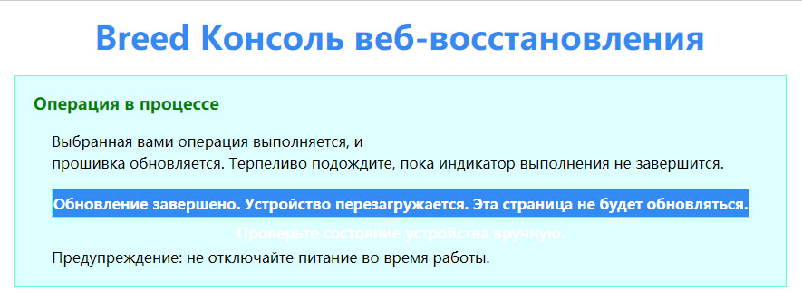

# Установка и настройка **OpenWRT** на роутер **Xiaomi mi router 3G**

## Ссылки
[Страница роутера на OpenWRT](https://openwrt.org/toh/xiaomi/mir3g)

## Установка

На роутер ранее была установлена прошивка **Padavan** и загрузчик **Breed**

* Зажимаем кнопку **Reset** на задней панели роутера и подключаем штекер питания.
Когда индикатор на передней модели начнет быстро мигать красным,
отпускаем кнопку.
* Когда индикатор начнет мигать голубым подключаемся по ethernet к роутеру,
в бразере переходм по адресу ```192.168.1.1```

* В консоли восстановления загружаем [ядро1](firmware/open-wrt/openwrt-23.05.4-kernel1.bin)
и [корневую файловую систему](firmware/open-wrt/openwrt-23.05.4-rootfs0.bin)
включаем **Автоматический перезапуск**, нажимаем кнопку **загрузить**

* Подверждаем свои действия нажатием кнопки **возобновить**

* Ждем окончания прошивки

*Перевод выпонен автоматически Гуглом*
* После прошивки и перезагрузки роутера заходим в браузере по адресу ```192.168.1.1```.

* Пароль для входа отсутствует. После входа устанавливаем пароль для **root**,
Добавляем публичный ключ для входа по **ssh**.
* Настраиваем подключение интернет.

## Увеличение файловой системы (extroot)

[Источник](https://openwrt.org/docs/guide-user/additional-software/extroot_configuration)

Для расширения корневой файловой системы использовал жетский диск на 500 Гб.
На диске под Windows сформировал два пустых раздела один размером 8 Гб, другой занял остальное место.
*Важно! Форматировать разделы не нужно!*

* Подключаем диск к роутеру
* Роутер перезагружаем, подключаем к интернет любым способом.
* Обновляем систему ```opkg update```.
* Устанавливаем необходимые пакеты
```opkg install block-mount kmod-fs-ext4 e2fsprogs kmod-usb-storage```
* Определяем как подключен диск
```ls -l /sys/block```.
У меня диск определился системой как **sda**.
* Форматируем разделы на диске
```
DISK="/dev/sda"
DEVICE="${DISK}1"
mkfs.ext4 -L extroot ${DISK}1
mkfs.ext4 -L media ${DISK}2
```
* Настраиваем точку монтирования **extroot**
```
eval $(block info ${DEVICE} | grep -o -e 'UUID="\S*"')
eval $(block info | grep -o -e 'MOUNT="\S*/overlay"')
uci -q delete fstab.extroot
uci set fstab.extroot="mount"
uci set fstab.extroot.uuid="${UUID}"
uci set fstab.extroot.target="${MOUNT}"
uci commit fstab
```
* Настраиваем точки монтирования **rootfs_data** и **ubifs**
```
ORIG="$(block info | sed -n -e '/MOUNT="\S*\/overlay"/s/:\s.*$//p')"
uci -q delete fstab.rwm
uci set fstab.rwm="mount"
uci set fstab.rwm.device="${ORIG}"
uci set fstab.rwm.target="/rwm"
uci set fstab.@global[0].delay_root="15"
uci commit fstab
```
* Монтируем раздел и переносим данные
```
mount ${DEVICE} /mnt
tar -C ${MOUNT} -cvf - . | tar -C /mnt -xf -
```
* Монтируем **media**
```
mkdir /media
MEDIA="${DISK}2"
eval $(block info ${MEDIA} | grep -o -e 'UUID="\S*"')
uci set fstab.media='mount'
uci set fstab.media.uuid="${UUID}"
uci set fstab.media.target="/mnt"
uci set fstab.media.enabled=1
uci commit fstab
```
Файл **/etc/config/fstab** должен выглядеть примерно так
```
config global
	option anon_swap '0'
	option anon_mount '0'
	option auto_swap '1'
	option auto_mount '1'
	option delay_root '15'
	option check_fs '0'

config mount 'extroot'
	option uuid '3e7d5ad7-1134-4e27-a9dc-bb823e30e823'
	option target '/overlay'

config mount 'rwm'
	option device '/dev/ubi0_1'
	option target '/rwm'

config mount 'media'
	option uuid '32ad3067-49b2-4e19-9a0b-9c1837441ead'
	option target '/mnt'
	option enabled '1'
```
* Перегружаем роутер ```reboot now```
## Устанавливаем DNSCrypt
[Источник](https://github.com/DNSCrypt/dnscrypt-proxy/wiki/Installation-on-OpenWrt)

* Обновляем установленные пакеты ```opkg update```
* Устанвливаем DNSCrypt-proxy ```opkg install dnscrypt-proxy2```
* Настраиваем DNSCrypt-proxy
```
uci add_list dhcp.@dnsmasq[0].server='127.0.0.53'
uci commit dhcp
```
* Перезапускаем службу ```/etc/init.d/dnsmasq restart```
* Проверяем работу ```nslookup instagram.com localhost```
* Вывод должен быть примерно таким
```
Server:         localhost
Address:        [::1]:53

Non-authoritative answer:
Name:   google.com
Address: 216.58.206.78

Non-authoritative answer:
Name:   google.com
Address: 2a00:1450:4001:81d::200e
```
* Файл **/etc/config/dhcp** должен выглядеть примерно так
```

config dnsmasq
	option domainneeded '1'
	option boguspriv '1'
	option filterwin2k '0'
	option localise_queries '1'
	option rebind_protection '1'
	option rebind_localhost '1'
	option local '/lan/'
	option domain 'lan'
	option expandhosts '1'
	option nonegcache '0'
	option cachesize '1000'
	option authoritative '1'
	option readethers '1'
	option leasefile '/tmp/dhcp.leases'
	option resolvfile '/tmp/resolv.conf.d/resolv.conf.auto'
	option nonwildcard '1'
	option localservice '1'
	option ednspacket_max '1232'
	option filter_aaaa '0'
	option filter_a '0'
	list server '127.0.0.53'

config dhcp 'lan'
	option interface 'lan'
	option start '100'
	option limit '150'
	option leasetime '12h'
	option dhcpv4 'server'
	option dhcpv6 'server'
	option ra 'server'
	option ra_slaac '1'
	list ra_flags 'managed-config'
	list ra_flags 'other-config'

config dhcp 'wan'
	option interface 'wan'
	option ignore '1'

config odhcpd 'odhcpd'
	option maindhcp '0'
	option leasefile '/tmp/hosts/odhcpd'
	option leasetrigger '/usr/sbin/odhcpd-update'
	option loglevel '4'
```
* Копируем начальные настройки **dnscrypt-proxy2.toml**
```
cp /etc/dnscrypt-proxy2/dnscrypt-proxy.toml /etc/dnscrypt-proxy2/dnscrypt-proxy.toml.original
```
