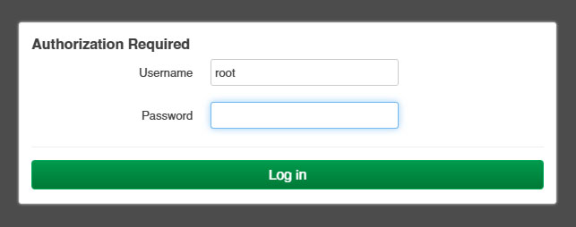

# Установка и настройка **OpenWRT** на роутер **Xiaomi mi router 3G**

## Ссылки
[Страница роутера на OpenWRT](https://openwrt.org/toh/xiaomi/mir3g)

## Установка

На роутер ранее была установлена прошивка **Padavan** и загрузчик **Breed**

* Зажимаем кнопку **Reset** на задней панели роутера и подключаем штекер питания.
Когда индикатор на передней модели начнет быстро мигать красным,
отпускаем кнопку.
* Когда индикатор начнет мигать голубым подключаемся по ethernet к роутеру,
в бразере переходм по адресу ```192.168.1.1```

* В консоли восстановления загружаем [ядро1](firmware/open-wrt/openwrt-23.05.4-kernel1.bin)
и [корневую файловую систему](firmware/open-wrt/openwrt-23.05.4-rootfs0.bin)
включаем **Автоматический перезапуск**, нажимаем кнопку **загрузить**

* Подверждаем свои действия нажатием кнопки **возобновить**

* Ждем окончания прошивки

*Перевод выпонен автоматически Гуглом*
* После прошивки и перезагрузки роутера заходим в браузере по адресу ```192.168.1.1```.

* Пароль для входа отсутствует. После входа устанавливаем пароль для **root**,
Добавляем публичный ключ для входа по **ssh**.
* Настраиваем подключение интернет.

## Увеличение файловой системы (extroot)

[Источник](https://openwrt.org/docs/guide-user/additional-software/extroot_configuration)

Для расширения корневой файловой системы использовал жетский диск на 500 Гб.
На диске под Windows сформировал два пустых раздела один размером 8 Гб, другой занял остальное место.
*Важно! Форматировать разделы не нужно!*

* Подключаем диск к роутеру
* Роутер перезагружаем, подключаем к интернет любым способом.
* Обновляем систему ```opkg update```.
* Устанавливаем необходимые пакеты
```opkg install block-mount kmod-fs-ext4 e2fsprogs kmod-usb-storage```
* Определяем как подключен диск
```ls -l /sys/block```.
У меня диск определился системой как **sda**.
* Форматируем разделы на диске
```
DISK="/dev/sda"
DEVICE="${DISK}1"
mkfs.ext4 -L extroot ${DISK}1
mkfs.ext4 -L media ${DISK}2
```
* Настраиваем точку монтирования **extroot**
```
eval $(block info ${DEVICE} | grep -o -e 'UUID="\S*"')
eval $(block info | grep -o -e 'MOUNT="\S*/overlay"')
uci -q delete fstab.extroot
uci set fstab.extroot="mount"
uci set fstab.extroot.uuid="${UUID}"
uci set fstab.extroot.target="${MOUNT}"
uci commit fstab
```
* Настраиваем точки монтирования **rootfs_data** и **ubifs**
```
ORIG="$(block info | sed -n -e '/MOUNT="\S*\/overlay"/s/:\s.*$//p')"
uci -q delete fstab.rwm
uci set fstab.rwm="mount"
uci set fstab.rwm.device="${ORIG}"
uci set fstab.rwm.target="/rwm"
uci set fstab.@global[0].delay_root="15"
uci commit fstab
```
* Монтируем раздел и переносим данные
```
mount ${DEVICE} /mnt
tar -C ${MOUNT} -cvf - . | tar -C /mnt -xf -
```
* Монтируем **media**
```
mkdir /media
MEDIA="${DISK}2"
eval $(block info ${MEDIA} | grep -o -e 'UUID="\S*"')
uci set fstab.media='mount'
uci set fstab.media.uuid="${UUID}"
uci set fstab.media.target="/mnt"
uci set fstab.media.enabled=1
uci commit fstab
```
Файл **/etc/config/fstab** должен выглядеть примерно так
```
config global
	option anon_swap '0'
	option anon_mount '0'
	option auto_swap '1'
	option auto_mount '1'
	option delay_root '15'
	option check_fs '0'

config mount 'extroot'
	option uuid '3e7d5ad7-1134-4e27-a9dc-bb823e30e823'
	option target '/overlay'

config mount 'rwm'
	option device '/dev/ubi0_1'
	option target '/rwm'

config mount 'media'
	option uuid '32ad3067-49b2-4e19-9a0b-9c1837441ead'
	option target '/mnt'
	option enabled '1'
```
* Перегружаем роутер ```reboot now```
* После перезагрузки проверяем, что все разделы примонтировались
```
df -h
```